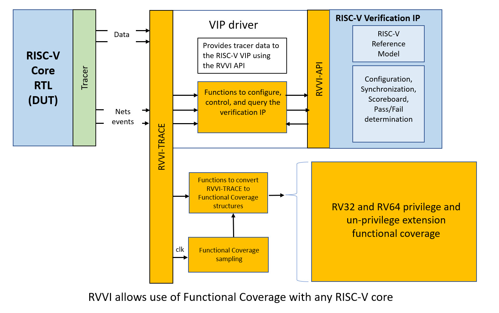
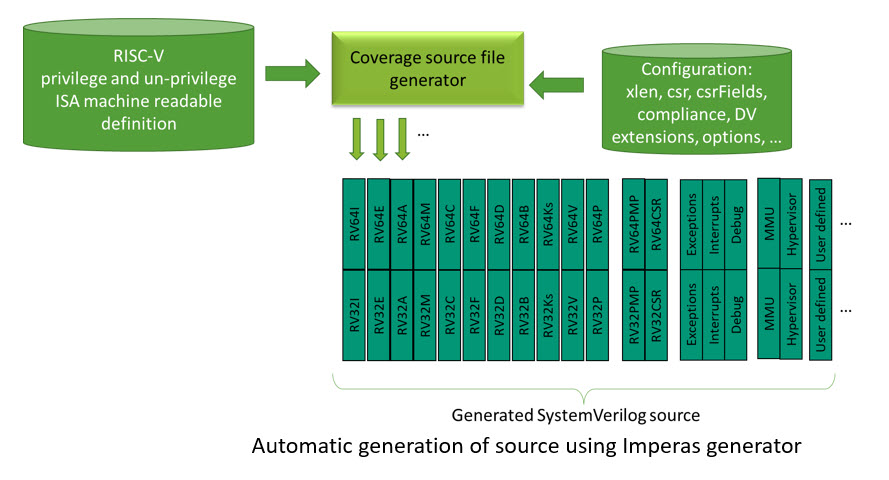

# riscvISACOV
SystemVerilog Functional Coverage for RISC-V ISA

This project is a work in progress (Nov. 2022) to provide the RISC-V Verification ecosystem and users an immediate solution to SystemVerilog Functional Coverage for the RISC-V ISA. The resultant source files are automatically generated from the Imperas configurable machine readable definition of the RISC-V ISA and make use of industry standards to allow widespread adoption and re-use.

This work is driven by Imperas with requirements from the OpenHW Group [ARVM-FunctionalCoverage project](https://github.com/openhwgroup/programs/blob/master/TGs/verification-task-group/projects/ARVM-FunctionalCoverage/meetings/2022/monthly-report-2022-Oct-17.md).

Each time a release is made in this GitHub repository it is a put in different branch. The default branch is the latest release. If you need earlier releases - use one of the previous branches.

This repository contains the initial coverage source files for the RV32I extension, with others available in the collaborative OpenHW projects and the Imperas product releases.

Information and details on the available coverage is here: [documentation](documentation)

The riscvISACOV code is independent of specific RISC-V core features and is targeting the ratified RISC-V International specification of the RISC-V ISA.

riscvISACOV has been developed and structured to connect to the open standard [RVVI-TRACE](https://github.com/riscv-verification/RVVI) interface making it easy to adopt and use in various RISC-V commercial and open source projects.

Background:
- DV methodology starts with a Verification Plan of what is needed
- This includes thousands of specific items to test
- Functional coverage is a mechanism to measure what has been tested
- The SystemVerilog language includes testbench syntax for this:
	- Coverpoints: individual items to measure and count into bins
	- Covergroups: collection of related points to measure at sampling events
- SystemVerilog simulators perform the counting and report results

For a processor there are different types of functional coverage required:  
- Standard ISA architectural features
	- unpriv. ISA items: mainly instructions, their operands, their values  
		=> these are standard and the same for all RISC-V processors  it is the spec
- Customer core design & micro-architectural features
	- priv. ISA items, CSRs, Interrupts, Debug block, 
	- pipeline, multi-issue, multi-hart, 
	- Custom extensions, CSRs, instructions  
	=> these are design specific and very customer bespoke  they are often proprietary
		- They will be about pipeline etc. and other core specific issues
		- They will include items like pipeline issues/hazards etc
		- These will always need to be added by customer for each core/design  
		
Yes, you will need functional coverage for all this

To get a feel for the amount of functional coverage required, lets consider the number of instructions in an RV64 with possible extension instructions (in Oct. 2022):  
- Integer: 56
- Maths: 13
- Compressed: 30
- FP-Single: 30
- FP-Double: 32
- Vector: 356
- Bitmanip: 47
- Krypto-scalar: 85
- P-DSP: 318 

For RV64 that is 967 instructions

And for each instruction you will need to write SystemVerilog covergroups and coverpoints  
Maybe 10-40++ lines of SystemVerilog for each instruction  

10,000-40,000++ lines of code to be written 
and be correct and working
For the non-priv. instructions etc
=> And  It is not design specific, nor specific to your core  
So quite a lot of source to create...

This necessary part of the verificaiton project is:
- Tedious and error-prone to write by hand
- For each design
- It is unnecessary to re-develop  it is the same for all ISA compliant cores
- There needs to automation

=> that is the focus of this work 

To automatically generate source functional coverage VIPs that can be used for many different core configurations/implementations.

Within Imperas there is a machine readable definition of the RISC-V ISA architectural definition.

From this definition, the Imperas' generator creates the source SystemVerilog files that are provided in the project.

The source files provided in this GitHub repository are all under the Apache 2.0 open source license.

The files provided by Imperas in their products are released under their proprietary licenses - please contact them for more information.

