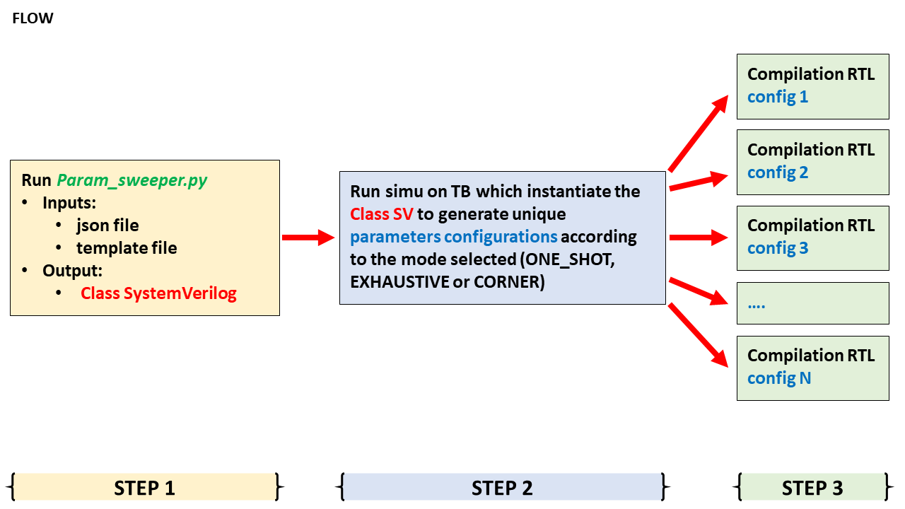

# Parameters sweeper

## Table of contents
1. [Introduction](#Introduction)
2. [Diagrams](##Diagrams)
3. [param_sweeper.py usage](#Usage)
4. [Example and first trials](#Example)
5. [List of file currently available](#Content)
6. [Licensing](#Licensing)

<!-- headings -->
<a id="Introduction"></a>
## Introduction
The param_sweeper tool is here to generate all the needed sets of configuration for the parametrizable design or TB... 
Based on the description of each parameters and their constraints, the param_sweeper can generate:
* All the relevant configurations
* Every corner configurations
* Random specific configuration

<a id="Diagrams"></a>
## Diagrams



This package contains a python script, **param_sweeper.py**. It takes the following arguments in input:
* *--json*: the json file should contains the list of all the design parameters, and their associated constraints, which are intented to be generated/covered. It is important to strickly use and follow the same format as the example file *example.json*
* *--i*: Name of a template file. It is a generic version of the design parameters file needed for the design compilation/elaboration
* *--o*: Name of a Prefix which will be used to rename the output files containing the generated set of parameters

**NOTE**:
It is possible to provide as many input template file as needed.But it is **mandatory** to follow the following rules:
* Only one file name per *--i* option. Same for *--o* option
* Same number of *--i* and *--o* options. In fact, these two options are working as a pair.

Example of usage assuming that there are three template files: 
* Command is: ***./param_sweeper.py --json example.json --i example_template1.txt --o Prefix1 --i example_template2.txt --o Prefix2 --i example_template3.txt --o Prefix3***
* Prefix1 is used for generated file based on example_template1.txt in the directory which name is Prefix1
* Prefix2 is used for generated file based on example_template2.txt in the directory which name is Prefix2
* Prefix3 is used for generated file based on example_template3.txt in the directory which name is Prefix3

<a id="Usage"></a>
## param_sweeper.py usage
To use the param sweeper python script, you have to do:
***./param_sweeper.py --i example_template.txt --o Prefix1 --i example_template_2.txt --o Prefix2***
It will generate a sv file named *output_example_class.svh*. Later on, it could obviously be set by passing an output file name as a argument of the script

<a id="Example"></a>
## Example and first trials
You could see that in the **tb.sv** file, there is call to two functions: 
```
    DP.Iterate_EXHAUSTIVE_or_CORNER(1,1);
	// ARG1: 1 => exhaustive mode | 0 => corner mode
	// ARG2: 1 => Print the generated parameters value | 0 => not print (it is the default value in case no argument is passed)		

    DP.RAMDOM(0); 
	// ARG1: 1 => Print the generated parameters value | 0 => not print (it is the default value in case no argument is passed)
```
In the ***example*** directory, assuming that you have a proper environment setup done (i.e *CV_DV_UTILS_DIR* variable set, proper .ucdprod or simulator set...), you can change (or not) the json file and/or argument given to the function *Iterate_EXHAUSTIVE_or_CORNER*/*RAMDOM* in **tb.sv** and then the flow is:
* For Siemens Questasim simulator: ***make run_tb_vsim***
* For Cadence Xcelium simulator: ***make run_tb_xrun***
* For Synopsys VCS simulator: ***make run_tb_vcs***

if the DEBUG option is enabled (i.e. *Iterate_EXHAUSTIVE_or_CORNER ARG2 = 1* or *RAMDOM ARG1 = 1*), you will see in the transcript file, messages like:
```
	# UVM_INFO output_example_class.svh(132) @ 0: reporter [DEBUG0] FRUIT:APPLE
	# 
	# UVM_INFO output_example_class.svh(133) @ 0: reporter [DEBUG1] COLOR:GREEN
	# 
	# UVM_INFO output_example_class.svh(134) @ 0: reporter [DEBUG2] NUMBERS:          1
	# 
	# UVM_INFO output_example_class.svh(132) @ 0: reporter [DEBUG0] FRUIT:APPLE
	# 
	# UVM_INFO output_example_class.svh(133) @ 0: reporter [DEBUG1] COLOR:GREEN
	# 
	# UVM_INFO output_example_class.svh(134) @ 0: reporter [DEBUG2] NUMBERS:          5
```
*In addition, you will also have warning messages each time the randomize() failed.*


<a id="Content"></a>
## List of file currently available
* **README.md**: This file
* **LICENSE**: Licensing information
* **Images/Param_gen.png**: Diagram, in png format, explaining the generation part
* **Images/Param_gen.svg**: Diagram, in svg format, explaining the generation part
* **Images/Param_flow.png**: Diagram, in png format, explaining the overall flow
* **Images/Param_flow.svg**: Diagram, in svg format, explaining the overall flow
* **scripts/param_sweeper_pkg.sv**:  python script which generated **output_example_class.svh** file

* **example/example.json**: example of input json file. The format should be taken as a template
* **example/example_template.txt**: Dummy input template file.
* **example/example_template_2.txt**: A second dummy input template file.
* **example/template_management.svh**: Class which take the different set of parameters (generated with **output_example_class.svh**) to provide unique parameter files (one for each set of parameters) based on **example_template.txt**. 
* **example/param_sweeper_pkg.sv**
* **example/tb.v**
* **example/Makefile**

<a id="Licensing"></a>
## Licensing
The param_sweeper is released under the Apache License, Version 2.0.
Please refer to the [LICENSE](LICENSE) file for further information.
