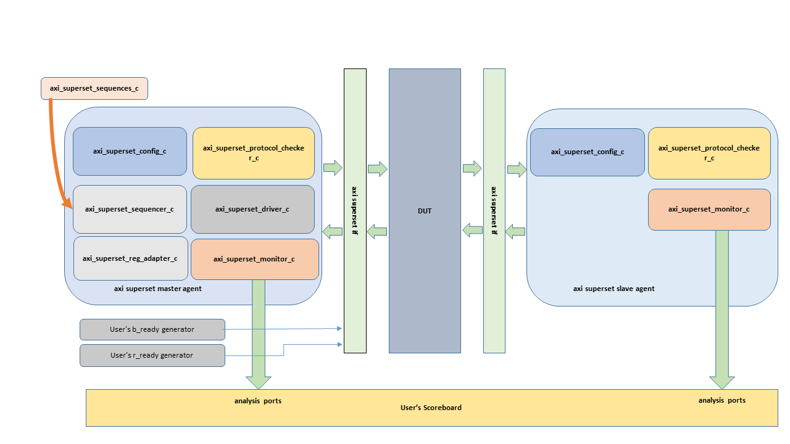
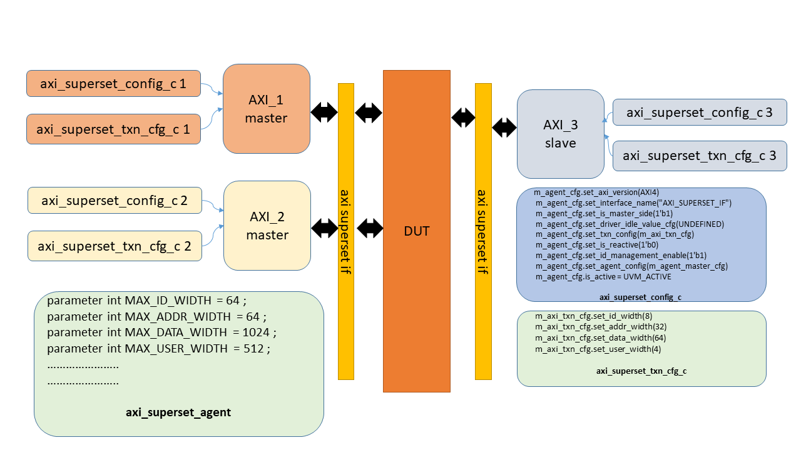

# AXI Agent

<!---
## Table of contents

1 .  [Introduction](#Introduction)
2 .  [Diagrams](#Diagrams)
3 .  [Configuration](#Configuration)
4 .  [Transaction Configuration APIs (axi_superset_txn_cfg_c)](#Transaction_Configuration)
5 .  [Sequences/ APIs](#Sequences/APIs)
6 .  [Sequences](##Sequences)
7 .  [Sequence APIs](##APIs)
8 .  [Integration](#Integration)
9 .  [Declaration](##Declaration)
10. [In the connect phase](##Connect_Phase)
11. [In the testbench test: launching sequence on the agent](#test)
12. [Declaration](##Declaration)
13. [Main phase](##Main_Phase)
14. [Creating the sequence](###Create_Sequence)
15. [Starting the sequence](###Start_Sequence)
16. [In the top](##Top)
17. [Ready Generation](##Ready)
-->

# Introduction <a name="Introduction"></a> 
The AXI superset agent is a highly configurable axi agent. It is based on the IHI0022G_b_amba_axi_protocol_specification from ARM(TM).
It provides the functionality of AXI master and AXI slave. 
In the master mode, it provides the sequences/APIs to drive READ/WRITE/ATOP transactions. 
In the slave mode, if configured to be a reactive agent, it can drive random responses. 


# Diagrams
The following figure shows the AXI agent in master and slave modes. As shown in the figure, the user needs to drive r_ready and b_ready signals.



The following figure shows multiple AXI systems.
The AXI Package defines the maximum allowed bus width. Each instance of the agent must be configured according to the protocol and the size of the buses used, for that instance. 



# Configuration

The AXI agent needs to be configured, in order for it to function correctly. The following APIs should be used to configure the AXI agent. 
## Agent Configuration APIs (axi_superset_config_c)
```
    m_agent_cfg.set_axi_version(AXI4)                  // Set the version of the AXI protocol: only AXI4 is supported currently
    m_agent_cfg.set_interface_name("AXI_SUPERSET_IF")  // Set the name of the interface AXI of the testbench: AXI_SUPERSET_IF by default if not set
    m_agent_cfg.set_is_master_side(1'b1)               // Set is the agent is on the master/slave side of the interface: 1'b1 => master agent, 1'b0 => slave agent
    m_agent_cfg.set_driver_idle_value_cfg(UNDEFINED)   // Set the type of idle value on the AXI interface bus: UNDEFINED ( X values) / ZERO ( '0 values ) / RANDOM
    m_agent_cfg.set_txn_config(m_axi_txn_cfg)          // Set the configuration for the transactions generated by the agent
    m_agent_cfg.set_is_reactive(1'b0)                  // Set if the slave agent is reactive: only work for slave agent, and allows the slave agent to generate random responses corresponding to the incoming requests
    m_agent_cfg.set_id_management_enable(1'b1)         // Set the management of unique id per transaction type : 1'b1 => enabling unique id management; 1'b0 => disabling unique id management
    m_agent_cfg.set_protocol_checker_enable(1'b1)    ; // Enable/Disable the protocol checker : 1'b1 => enable the protocol checker ; 1'b0 => disabling the protocol checker ; Enable by default
    m_agent_cfg.set_covergroup_enable(1'b0)          ; // Enable/Disable the covergroup : 1'b1 => Instantiate the covergroup ; 1'b0 => Don't instantiate the covergroup ; Disable by default

    m_agent_cfg.set_agent_config(m_agent_master_cfg) ; // Setting the configuration of the agent with the configuration created above

    // Creating an active master
    m_agent_cfg.is_active = UVM_ACTIVE;

```
## Transaction Configuration APIs (axi_superset_txn_cfg_c)

THe AXI package (axi_superset_pkg) has the parameters that define the maximum allowed size of the buses. For example (this list is not exhaustive): 

  * parameter int MAX_ID_WIDTH   = 64   ; // subjective maximum 
  * parameter int MAX_ADDR_WIDTH = 64   ; // subjective maximum
  * parameter int MAX_DATA_WIDTH = 1024 ; // subjective maximum
  * parameter int MAX_USER_WIDTH = 512  ; // subjective maximum

  * parameter int MAX_LOOP_WIDTH    = 8  ; // Maximum from the protocol
  * parameter int MAX_MMUSID_WIDTH  = 32 ; // Maximum from the protocol
  * parameter int MAX_MMUSSID_WIDTH = 20 ; // Maximum from the protocol

 class axi_superset_txn_cfg_c provides the APIs to configure a transaction as per the protocol requirement.

 This class contains the fields necessary to configure the oversized fields
 of the axi_superset_txn_c class.

 The fields are protected and may only be accessed by using the set/get
 function of the class.

```
    m_axi_txn_cfg.set_id_width(8)     ; // Number of bit of the ID signals on the interface
    m_axi_txn_cfg.set_addr_width(32)  ; // Number of bit of the ADDR signals on the interface
    m_axi_txn_cfg.set_data_width(64)  ; // Number of bit of the DATA signals on the interface
    m_axi_txn_cfg.set_user_width(4)   ; // Number of bit of the USER signals on the interface
```

This class can also configure the maximum of cycles of delay of the transactions: the transaction contains three fields

    rand int unsigned          m_delay_cycle_chan_X   ; // Delay before driving the transaction on the AW/AR/B/R channels
    rand int unsigned          m_delay_cycle_chan_W   ; // Delay before driving the transaction on the W channel
    rand int unsigned          m_delay_cycle_flits[$] ; // Delay in cycles between two flits on the W or the R channels

The configuration field m_max_delay_cycle allows to configure the maximum value 
used by the constraint of the transaction to randomize the previous fields.

# Randomization of a transaction (axi_superset_txn_c)
This class contains the fields necessary to represent each kind of transaction
from either AXI4 or AXI5 protocols.

Only the Atomic_Transactions and the Unique_ID_Support properties from the AXI5
protocol are supported by this agent.

This class can manage either a WRITE_REQ, a READ_REQ, a WRITE_RSP or
a READ_RSP and the type of the transaction is defined in the m_txn_type
field.

The AXI protocol version is defined by the field m_axi_version. Currently all
signals from AXI4 protocol and the atop/idunq signals of the AXI5 protocol 
are supported by the agent.

## Error Insertion 
Protocol errors can be enabled/disabled in the transaction with the field m_err:
if the value of this field is NO_ERR, the transaction will be randomized with constraints
to respect the AXI protocol. Other values of m_err are not yet supported.

## Bus Width 
By default, the bus width of some fields are oversized to allow the user to
use this transaction with multiples instances of different interfaces AXI
in the same testbench.
* The oversized fields are the fields m_id, m_addr, m_data, m_user, m_loop,
* m_mmusid and m_mmussid.
* The MAX value of these fields are defined in the package above this module.
* Typedef of each oversized fields are defined in the package, to allow the
  user to reuse them in its testbench.
* It is possible to configure the actual width of these configurable fields of an instance
  of a transaction with the class m_txn_config.
* The configuration class contains the fields and the methods necessary to configure
  the width of the configurable bus widths.
* It is assumed that the transaction already have its own configuration before randomizing it,
  as part of the randomization of the transaction depends of its configuration.
* The randomization is in charge of fixing to 0 the unused bits between the
  configurated bus width and the MAX width.
* When created, the transaction already have a default configuration, which set the bus widths to
  their MAX values by default.

## Transaction characteristics 
Concerning the AXI transaction, the class contains the following elements:
* All the metadatas of the transaction : id, addr, size, len, burst, etc...
* The total payload of the transaction : all flits of data of the
  transaction are stored in the fields m_data, m_wstrb, m_last and
  m_resp.
These fields are queues, where each item is a single flit
of the transaction.
* m_wstrb is concerned only in a case of a AXI_WRITE_REQ.
* m_resp is concerned only in cases of an AXI_WRITE_RSP or an AXI_READ_RSP.
  This field should only have one flit in a case of an AXI_WRITE_RSP, and can have more than
  one flit only in a case of a AXI_READ_RSP.
* In the randomization, the field m_len is solved before all the payload fields : that means
  that the size of the queue (and so number of flit of the transaction) for the m_data/m_wstrb/etc
  is determined by the value of the len.
  So when the transaction is randomized, the value of the len have to be constrained to match the
  number of flits wanted by the user.
  The user can also constrain each flit (data/wstrb/etc) as long as their number matches the len.
* The write strobe is managed differently: to obtain a write
  strobe coherent with the protocol instead of a fully random write
  strobe, the write strobe is regenerated in the post randomize phase
  using the equation of the specification. If the user decides to set
  himself the write strobe, he must set a valid write strobe by
  himself.
* By default, when the transaction is created but not yet randomized, the queue are empty and all fields
  contains X
* Concerning the cache value, a mem_type from the section A4.4 of the
  specification IHI022H_c is randomized. Then in the driver, depending of
  the transaction type, the corresponding cache value is sent on the
  interface. The user should be aware of the memory type that should be
  sent when randomizing the transaction. Also, only preferred AXI4 cache 
  value from the specification are used, not the legal AXI3 values

## Inter Transactional Delay 
This class also contains fields to define delays. The delays are expressed
here in number of cycles:
* The field m_delay_cycle_chan_X defines the number of cycles before enabling the
  valid signal of the corresponding channel.
  The channels concerned by this field are the channels AW, AR, R and B
* The field m_delay_cycle_chan_W defines the number of cycles before enabling the
  valid signal of the W channel. This fields is here to allow to
  desynchronize the AW and W channels.
* The field m_delay_cycle_flits defines the number of cycles between each flits of
  a transaction before enabling the valid signal of the W channel or the R channel.
  Each flit can have its own delay defined in the queue m_delay_cycle_flits.
* By default, the delays are configured to be inferior to 256 cycles. If the user want to set them, 
  it can either override the constraint in a derived class or use the set functions to redefine them
  after the randomization.

## Methods
* convert2string :
   Convert the transaction into a string to print it in debug message.
* get_total_number_of_bytes_exchanged :
   Return the total number of bytes exchanged by the transaction on the
   interface
* get_total_number_of_bytes_in_mem :
   Return the total number of bytes written or read in the memory by the
   transaction
- compare_bytes_in_mem :
   Compare two transactions to check if the number of bytes written or read
   in the memory is the same
* append_write_flit()
   User provides a data flit and it is appended to the write request.
* append_read_flit()
   User provides a data flit and it is appended to the read response.
* set/get functions for all metadata/payload fields of the transactions

The user fields are not totally supported in this agent for the moment: it
is not possible currently to define for each channel its own user bus width.
All channels have the same user fields bus width currently, defined in the
package.

## Supported/Unsupported features

### List of supported but untested features

#### Atomic transactions
* Generation of valid IDs when atomic and normal transactions are used in the same test (section E1.1.4)
* Only AtomicLoad transactions with little endianness and AtomicSwap transactions have been tested 
* Only 4 and 8-byte transfers have been tested

#### Misc
* Generation of cache values: only Device and Normal mem type’s values were tested, and only the preferred cache value for AXI4 protocols are supported
*	Undersized transaction configuration

### List of unsupported features
*	Protocol error insertion is unsupported: randomization of non-valid transactions is not supported, but the user can set the fields after the randomization.
*	FIXED and WRAP burst mode
*	Protected accesses: AxPROT signals
*	Region accesses : AxREGION( can be used, but no verification associated )
*	QOS accesses: AxQOS: The protocol does not specify the exact use of the QoS identifier.
*	No constraints with ATOP_CMP transactions
*	No memory/system configuration in the slave agent: responses are only randomized accordingly to the request.
*	All signals from the AXI5 protocol, apart from the ATOP and IDUNQ signal, are not supported( can be used, but no verification associated ) 
*	There is no register predictor in the agent: the registers from the regmodel are not updated automatically when an access to a register happens on the interface.
*   Atomic transactions with big endianness
* The protocol AXI5-Lite is not supported

## Basic coverage
Covegroups for the base coverage may be activated in the agent with the set_covergroup_enable function of the agent configuration.
There are three types of covergroup:
* axi_superset_req_cg : covergroup to sample the metadata from the AW/AR channels ( id, addr, len, etc..)
* axi_superset_rsp_cg : covergroup to sample the metadata from the B/R channels ( id )
* axi_superset_dat_cg : covergroup to sample the payload from the W/R channels ( data, wstrb ( W only ), resp ( R only ) )

For the moment, only AXI4 fields and the atop field are covered by these covergroup.
As by definition the user field is a field totally dependent of the user, the user fields is not sampled by these covergroup.
These covergroup are generics, if the user want more specifics coverage, different covergroup should be defined in the user scoreboard.

## Unique ID management 
AXI master agent can be configured to manage the IDs in the place of the user.
* If id_management_enable is set to 1, the agent will generate unique IDs for each transactions: read transactions and write transactions will have their own unique IDs.
* If id_management_enable is set to 0, the agent will let the ID be randomized normally without managing them.

In the case of atomic transactions, the management of ID is done by default no matter the id_management_enable configuration value, since atomic transactions need unique ID.
That means that if the id managemetn is disabled for the agent, non-atomic transactions will have semi-random ID but atomic transactions will have unique IDs: there will just be a constraint to assure that atomic transaction can't have the same ID as another outstanding transactions.

In the case of AXI5 transactions, the AxIdunq signals depends of this configuration:
* If id_management_enable is set to 1, the agent will generate transctions with AxIdunq set to 1 ;
* If id_management_enable is set to 0, the agent will generate transctions with AxIdunq set to 0 ;

## Write strobe
To respect the protocol AXI concerning aligned/unaligned accesses, the write strobe flit of a transaction are not randomized normally: after the randomize is done, the post randomize task regenerate a random write strobe flit aligned on the address of the flit.
That means that if the user try to add a constraint in its randomize concerning the write strobe, it will be ignored. For the user to set up its own write strobe, the function set wstrb_flit should be used after the randomization.

# Sequences/ APIs 

## Sequences

The sequence libs provides a certains number of sequences. 
Here is the list of sequences:
* sequence which send "num_txn" random request transaction from the master
```
 axi_superset_master_sequence_c
```
* sequence which send "num_txn" random write only request transactions from the master
```
axi_superset_master_write_sequence_c
```
* sequence which send "num_txn" random read only request transactions from the master
```
axi_superset_master_read_sequence_c
```

## Sequence APIs

Sequence lib provides a certain number of task to send transactions to the driver. 
Here is the list of all such tasks:

* send_txn

Task in charge of sending a transaction given by the user.
For this task to work correctly, it is assumed that the transaction is
already randomized with its own constraints before giving it to the task
```
    protected task send_txn
    ( 
      input axi_superset_txn_c  item, // Transaction to send to the driver
      input int txn_number = 0        // Debug input, to print the number of the transaction if this transaction is part of a bigger sequence of transactions.
    );
```
* send_txn_get_rsp

Task in charge of sending a transaction given by the user.
For this task to work correctly, it is assumed that the transaction is
already randomized with its own constraints before giving it to the task
This task wait for the responses 

```
    protected task send_txn_get_rsp
    ( 
      input axi_superset_txn_c  item, // Transaction to send to the driver
      output axi_superset_txn_c  rsp
    );

```
* send_random_req

Task in charge of sending a random request.
By default, the transaction is an AXI4 request with no error. 
This task should only be used in a sequence for a Master agent.
```
    virtual task send_random_req
    (
      input axi_dv_ver_t   ver  = AXI4,
      input axi_dv_lite_t  lite = LITE,
      input axi_dv_err_t   err  = NO_ERR,
      input int txn_number = 0
    );

```
* send_random_write

Task in charge of sending a write request
By default, the transaction is an AXI4 request with no error. 
This task should only be used in a sequence for a Master agent.
```
    protected task send_random_write
    (
      input axi_dv_ver_t      ver  = AXI4,
      input axi_dv_lite_t     lite = NO_LITE,
      input axi_dv_err_t      err  = NO_ERR,
      input int txn_number = 0
    );
```
* send_random_read

Task in charge of sending a read request
By default, the transaction is an AXI4 request with no error. 
This task should only be used in a sequence for a Master agent.
```
    protected task send_random_read
    (
      input axi_dv_ver_t      ver     = AXI4,
      input axi_dv_lite_t     lite    = NO_LITE,
      input axi_dv_err_t      err     = NO_ERR,
      input int txn_number = 0
    );

```

The file axi_superset_sequence_lib contains different kind of 
base sequences using these tasks, and they contains example on how
to randomize the tranasction.

# Integration

Following steps needs to be taken to integrate
====================================================================================

# In the top ENV: Instantiation and create memory response mode

## Declaration

    // Declaration of the agent module
    axi_superset_agent_c  m_agent_master;

    // Declaration of the configuration of the agent
    axi_superset_config_c  m_agent_master_cfg ;

    // Configuration of the type of transaction generated by the agent
    axi_superset_txn_cfg_c  m_axi_txn_cfg;


## In the build_phase: Create and configuration of the agent 

    // Create in build_phase
    m_agent_master = axi_superset_agent_c::type_id::create("MASTER_AGENT",this);

    // Create the transaction configuration for the agent
    m_axi_txn_cfg = new("TB_TXN_CFG") ;
    m_axi_txn_cfg.set_id_width(8)     ; // Number of bit of the ID signals on the interface
    m_axi_txn_cfg.set_addr_width(32)  ; // Number of bit of the ADDR signals on the interface
    m_axi_txn_cfg.set_data_width(64)  ; // Number of bit of the DATA signals on the interface
    m_axi_txn_cfg.set_user_width(4)   ; // Number of bit of the USER signals on the interface
    m_axi_txn_cfg.set_max_delay_cycles(10)   ; // Maximum number of cycle of delay between two transactions, or between two flits of the transactions
 
    // Create the agent configuration
    m_agent_master_cfg = new("MASTER_CFG");
    m_agent_master_cfg.set_axi_version(AXI4)                 ; // Set the version of the AXI protocol: only AXI4 is supported currently
    m_agent_master_cfg.set_interface_name("AXI_SUPERSET_IF") ; // Set the name of the interface AXI of the testbench: AXI_SUPERSET_IF by default if not set
    m_agent_master_cfg.set_is_master_side(1'b1)              ; // Set is the agent is on the master/slave side of the interface: 1'b1 => master agent, 1'b0 => slave agent
    m_agent_master_cfg.set_driver_idle_value_cfg(UNDEFINED)  ; // Set the type of idle value on the AXI interface bus: UNDEFINED ( X values) / ZERO ( '0 values ) / RANDOM
    m_agent_master_cfg.set_txn_config(m_axi_txn_cfg)         ; // Set the configuration for the transactions generated by the agent
    m_agent_master_cfg.set_is_reactive(1'b0)                 ; // Set if the slave agent is reactive: only work for slave agent, and allows the slave agent to generate random 
                                                               // responses corresponding to the incoming requests
    m_agent_master_cfg.set_id_management_enable(1'b1)        ; // Set the management of unique id : 1'b1 => enabling unique id management; 1'b0 => disabling unique id management
    m_agent_cfg.set_protocol_checker_enable(1'b1)            ; // Enable/Disable the protocol checker : 1'b1 => enabling the protocol checker ; 1'b0 => disabling the protocol checker ; Enabled by default
    m_agent_master_cfg.set_covergroup_enable(1'b0)           ; // Enable/Disable the covergroup : 1'b1 => Instantiate the covergroup ; 1'b0 => Don't instantiate the covergroup ; Disabled by default

    m_agent_master.set_agent_config(m_agent_master_cfg) ; // Setting the configuration of the agent with the configuration created above

    // Creating an active master
    m_agent_master.is_active = UVM_ACTIVE;

The configuration of the agent must be created, configured and given to the agent via the function set_agent_config in the build_phase of the environment where the agent is created so the build_phase of the different modules of the agent can be created/configured correctly.

## In the connect phase

Declaration of the analysis_port in the monitor of the agent:

    uvm_analysis_port #(axi_superset_txn_c) m_axi_superset_read_req_packets_collected  ;
    uvm_analysis_port #(axi_superset_txn_c) m_axi_superset_write_req_packets_collected ;
    uvm_analysis_port #(axi_superset_txn_c) m_axi_superset_read_rsp_packets_collected  ;
    uvm_analysis_port #(axi_superset_txn_c) m_axi_superset_write_rsp_packets_collected ;

In the connect_phase of the user environment:

    m_agent_master.m_monitor.m_axi_superset_write_req_packets_collected.connect( <USER_SCOREBOARD_MODULE>.analysis_export );
    m_agent_master.m_monitor.m_axi_superset_read_req_packets_collected.connect(  <USER_SCOREBOARD_MODULE>.analysis_export  );
    m_agent_master.m_monitor.m_axi_superset_write_rsp_packets_collected.connect( <USER_SCOREBOARD_MODULE>.analysis_export );
    m_agent_master.m_monitor.m_axi_superset_read_rsp_packets_collected.connect(  <USER_SCOREBOARD_MODULE>.analysis_export  );

# In the testbench test: launching sequence on the agent

The file axi_superset_sequence_lib.svh contains a library of sequences that the user can use for its testbench

## Declaration

    // Example of different sequences availables
    axi_superset_master_sequence_c        master_seq;
    axi_superset_master_write_sequence_c  master_write_seq;
    axi_superset_master_read_sequence_c   master_read_seq;

## Main phase

### Creating the sequences

The user has different options to configure the number of transactions sent by a sequence:
- On the command-line, using the plusarg +NUM_TXN when launching the test
  - Creation:

        master_seq       = axi_superset_master_sequence_c::type_id::create( "master_seq" , this);
        master_write_seq = axi_superset_master_write_sequence_c::type_id::create( "master_write_seq" , this);
        master_read_seq  = axi_superset_master_read_sequence_c::type_id::create( "master_read_seq", this);

  - Advantage: the sequence can be override since the sequence are registered in the factory
  - Default:   all sequences in the same test will have the same number of transctions.
- Using the argument num_txn in the constructor
  - Creation:

        // if the user want to create each instance of a sequence with its specific number of transaction
        master_seq       = new( "master_seq"      , 300 );
        master_write_seq = new( "master_write_seq", 400 );
        master_read_seq  = new( "master_read_seq" , 200 );

  - Advantage: Each sequence can be created with its own number of transactions.
  - Disadvantage: Since the create function is not used, the sequence can't be override since the factory is not used.
- Set function: using the set function after creating the sequence to override the number of transaction of the sequence
  - Creation and set:

        master_seq       = axi_superset_master_sequence_c::type_id::create( "master_seq" , this);
        master_write_seq = axi_superset_master_write_sequence_c::type_id::create( "master_write_seq" , this);
        master_read_seq  = axi_superset_master_read_sequence_c::type_id::create( "master_read_seq", this);

        master_seq.set_num_txn( 300 );
        master_write_seq.set_num_txn( 200 );
        master_read_seq.set_num_txn( 500 );

  - Advantage: use the factory, so the override feature can be used, and each sequence can have its own number of transaction
  - Disadvantage: Need to use the set function, which will override a precedent plusarg/argument in constructor.

### Starting the Sequence

    master_seq.start(env.m_agent_master.m_sequencer);
    master_write_seq.start(env.m_agent_master.m_sequencer);
    master_read_seq.start(env.m_agent_master.m_sequencer);

## In the Test-bench top
 
    axi_superset_if  axi_vif     (.clk_i(clk_i), .reset_n(reset_n));
    axi_superset_if  axi_vif_bis (.clk_i(clk_i), .reset_n(reset_n));

    initial begin
      uvm_config_db #(virtual axi_superset_if )::set(uvm_root::get(), "*", "AXI_SUPERSET_IF"    , axi_vif );
      uvm_config_db #(virtual axi_superset_if )::set(uvm_root::get(), "*", "AXI_SUPERSET_IF_BIS", axi_vif_bis );
    end
 
The name of the interface in the uvm_config_db should match the interface_name parameter which was set in the configuration in the environment. This allows to use multiple agent  in the same testbench with different interfaces AXI

## Ready Generation 
Be warned that the signal b_ready and r_ready are not driven. The user needs to drive these signals to be able the acknowledge a response. 


## Licensing
The axi_superset_agent is released under the Apache License, Version 2.0.
Please refer to the [LICENSE](LICENSE) file for further information.


