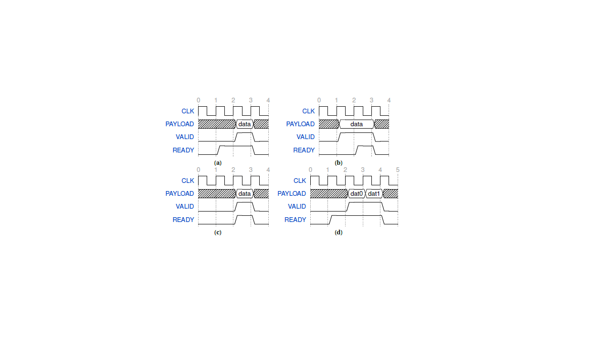

# Introduction 

Parametrized generic agent is an UVM agent. 
It is used to drive requestes of type req_t (to be defined by user). It monitors request (of type req_t) and responses (of type rsp_t(to be defined by user)) 

## Parameters
The class generic_agent is a parametrized uvm class. 
Following are the parameters of this class: 
```
   type req_t
   type rsp_t
```
The following figure shows the ready valid protocol used by the generic class. The user has to provide its own ready signal. 


## Analysis Ports

Following analysis ports are provided. They can be used to send the requests and the responses to a remote SB.  
```
  uvm_analysis_port #(req_t) ap_req;
  uvm_analysis_port #(rsp_t) ap_rsp;
```
## Generic Transaction (generic_txn)
Transaction class contains following variables. 

```
    rand req_t          m_req;
    // To get the response from the drive
    // Can be useful if response handler is used 
    rsp_t               m_rsp;

    // ------------------------------------
    // Delay between two transactions
    // ------------------------------------
    rand int            m_txn_idle_cycles;
```

 
## Interface 
generic_if: 

This is a parametrised interface:

It requires following parameters

```
    parameter type req_t = logic;
    parameter type rsp_t = logic;
```

Following signals need to be connected to the write/read response interface

```
  //     request interface
  logic                  req_valid;
  logic                  req_ready;
  req_t                  req;

  //      response interface
  logic                  rsp_valid;
  logic                  rsp_ready;
  rsp_t                  rsp;
```
### Ready Signal 
User should connect his/her own ready signal directly to req_ready.

## APIs
The class generic_sequences provide following API to generate and drive a sequences. 
```
  protected task send_txn( input generic_txn#(req_t, rsp_t)  item);
```
# Integration

## Following steps need to be taken to integrate
 * In the top pkg: Declare the struck/class of the type of request (req_t) and response(rsp_t) to be driven for example:  
```
  import generic_agent_pkg::*;
  
  // Structure for the config bus
  typedef struct packed {
    logic [ADDR_WIDTH -1  : 0] m_addr;
    logic [DATA_WIDTH -1  : 0] m_data;
    logic [DATA_WIDTH/8 -1: 0] m_strb;
    logic [ID_WIDTH -1    : 0] m_id;
    logic                      m_rdwr;
    logic [31 : 0]             m_size;
  } req_t;

  typedef struct packed {
    logic [DATA_WIDTH -1  : 0] m_data;
    logic [ID_WIDTH -1    : 0] m_id;
    logic                      m_error;
  } rsp_t;

```
 * In the top ENV: Instantiation and create generic agent
```
    generic_agent                #(req_t, rsp_t) m_generic_agent;  // Active generic agent
    m_generic_agent  = generic_agent#(req_t, rsp_t)::type_id::create("g_agent", this);


```

 * Declare generic interface in the TB Top And pass it on using config db 
```
  generic_if #(req_t, rsp_t) m_generic_vif (.clk_i( clk ), .rst_ni( resetn )); 
  uvm_config_db #( virtual generic_if #( req_t, rsp_t) )::set(uvm_root::get(), "*", "g_agent",  m_generic_vif);
```

## Licensing
The generic_agent is released under the Apache License, Version 2.0.
Please refer to the [LICENSE](LICENSE) file for further information.
