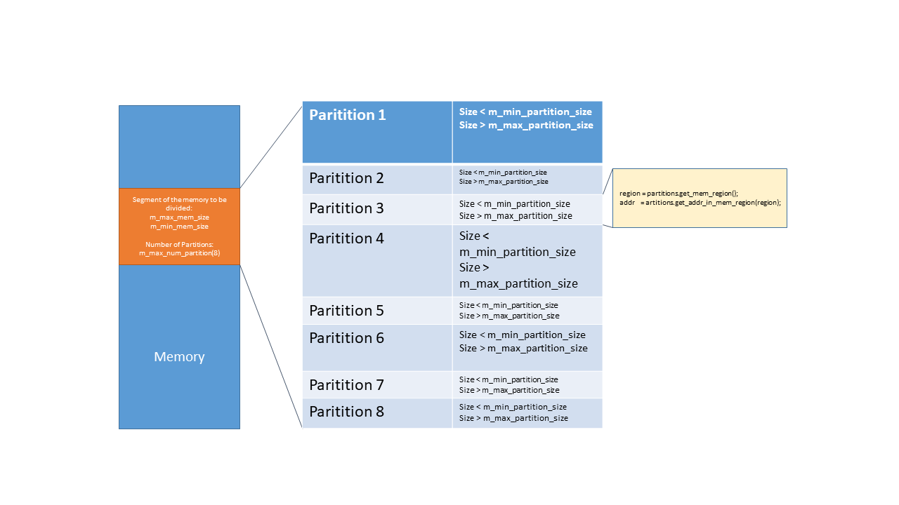

# Memory Partition 

## Introduction 
Memory Partition is a parametrized UVM class. It is parametrized by addres width. 
This class holds the configuration of memory regions. Memory is randomly divided into different regions  

# Diagram

Following diagram explain the paritioning of a memory segment of a large memory. 
It is to be divided into max 8 partitions of min and max sizes (to be defined by user).
APIs can be used to get the address within these paritions. 


# Diagram

Following diagram explain the paritioning of a memory segment of a large memory. 
It is to be divided into max 8 partitions of min and max sizes (to be defined by user).
APIs can be used to get the address within these paritions. 


## Configuration Variable 
Following configuration variables are required to be used to parition a memory. 
```
   // --------------------------------------------------------------------------
   // USER provides these informations
   // --------------------------------------------------------------------------

   // --------------------------------------------------------------------------
   // Segment of a memory to be divided in between   : m_max_mem_size and m_min_mem_size
   // --------------------------------------------------------------------------
   rand bit [addr_width-1:0]  m_max_mem_size;
   rand bit [addr_width-1:0]  m_min_mem_size;

   // --------------------------------------------------------------------------
   // The size of the partitions in between : m_max_partition_size and m_min_partition_size
   // --------------------------------------------------------------------------
   rand bit [addr_width-1:0]  m_max_partition_size;
   rand bit [addr_width-1:0]  m_min_partition_size;

   // --------------------------------------------------------------------------
   // The maximum number of partitions      : m_max_num_partition, minimum is 2 
   // --------------------------------------------------------------------------
   rand int                   m_max_num_partition;

   // ------------------------------------------
   //  m_mem_regions: 
   //   MEM_CLOSE_REGIONS   : Regions devided are close to each other 
   //   MEM_RANDOM_REGIONS  : Whole space of memory is divided randomly          
   //   MEM_EXTREME_REGIONS : It provides the lowest an highest region 
   // --------------------------------------------
   rand mem_region_t          m_mem_regions;
```
## APIs 

Following APIs are provided to access different information regarding the divided memory segment. 
```
   // ------------------------------------------------------------------------
   // get number of partitions 
   // ------------------------------------------------------------------------
   function int get_parition_num();

   // ------------------------------------------------------------------------
   // Get the random regions                                         
   // ------------------------------------------------------------------------
   function int get_mem_region();

   // ------------------------------------------------------------------------
   // Get the random address within a provided region
   // ------------------------------------------------------------------------
   function [addr_width-1:0] get_addr_in_mem_region(int region);

   // ------------------------------------------------------------------------
   // Get the partition size within a provided region
   // ------------------------------------------------------------------------
   function [addr_width-1:0] get_partition_size(int region);

   // ------------------------------------------------------------------------
   // Get the number of partitions
   // ------------------------------------------------------------------------
   function int get_num_mem_partitions();

   // ------------------------------------------------------------------------
   // convert2string
   // ------------------------------------------------------------------------
   virtual function void print_memconfig();

   // ------------------------------------------------------------------------
   // If we want a request to be strictly within a region, 
   // it is required that the size dose not go beyond the region 
   // ------------------------------------------------------------------------
   // Get the request size
   // The request in the case of DRAM can be max high_addr -random_addr
   // --------------------------------------------------------------------
   function int get_request_size(bit [addr_width -1:0] addr, int partition, bit rd_wr);

   // ------------------------------------------------------------------------
   // get read or write
   // ------------------------------------------------------------------------
   function bit get_rd_wr(bit [addr_width -1:0] addr);

```

## Integration 

 * In the top ENV: Declare and create memory partition class 
```
  import memory_partitions_pkg::*;
   
  // ----------------------------------------------
  // Memory partition 
  // Divides the memory in small partitions 
  // ----------------------------------------------
  memory_partitions_cfg        #(PHYSICAL_ADDR_WIDTH) m_memory_partitions;

  In the build phase: 
  m_memory_partitions = memory_partitions_cfg#(PHYSICAL_ADDR_WIDTH)::type_id::create($sformatf("memory_partitions"), this);

```

* Randomize in the testbase 
Following randomization will create 8 partition of the memory. The size of the memory to be paritioned is from 32 to 64 cache line width. 
Each parition would be of min 1 and max 8 cache line width. 

One of the example. A memory segment of 32 cache line width is divided into 8 paritions of min 1 to max 8 cache line width.
Parition 1: 1*Cache line 
Parition 2: 2*Cache line 
Parition 3: 5*Cache line 
Parition 4: 4*Cache line 
Parition 5: 8*Cache line 
Parition 6: 4*Cache line 
Parition 7: 5*Cache line 
Parition 8: 3*Cache line 

```

    if(!env.m_memory_partitions.randomize() with { m_max_mem_size       == 64*CACHE_LINE_WIDTH ;
                                                   m_min_mem_size       == 32*CACHE_LINE_WIDTH  ;
                                                   m_max_partition_size == 8*CACHE_LINE_WIDTH  ;
                                                   m_min_partition_size == CACHE_LINE_WIDTH    ;
                                                   m_max_num_partition  == 8      ; } ) begin
       `uvm_fatal( "RANDOMIZE_FAILED", "MEMORY PARTITION" );
    end
```
* Use case example of memory parition within a sequence 
```
///////////////////////////////////////////////////////////
// Single access within a region
//////////////////////////////////////////////////////////
class single_request_in_region extends  base_sequence;
  `uvm_object_utils( single_request_in_region );

  static int        region;
  txn               item;

  function new( string name = "single_txn_sequence" );
    super.new(name);
  endfunction: new

  virtual task body( );
    super.body();
    
    item = txn::type_id::create("single request");

    // ----------------------------------------------
    // Get a random region and an address within the region  
    // Randomize transaction item with in a region
    // -----------------------------------------------
    region     = m_partitions.get_mem_region(); 
    req_addr   = m_partitions.get_addr_in_mem_region(region);

    // ----------------------------------------------
    // Randomize transaction item with in a region
    // -----------------------------------------------
    if ( !item.randomize() with {m_req_addr        == req_addr;})
        `uvm_fatal("body","Randomization failed");

    start_item( item );
    finish_item( item );

  endtask: body

endclass: single_request_in_region
```

## Licensing
The memory_partition is released under the Apache License, Version 2.0.
Please refer to the [LICENSE](LICENSE) file for further information.
