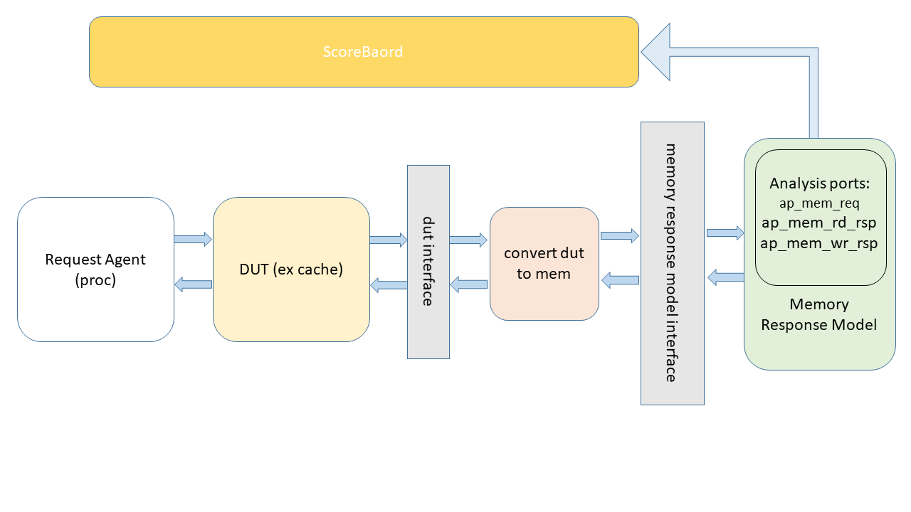

# Introduction 

Parametrized Memory Response Model (MRM) is UVM passive agent (A slave agent, it doesn't initiate a transaction). It is used to respond to the memory requests from the DUT within a verification environment. 
Following are the notable characterisitics of MRM
* The ordering of the responses can be configured including random order, in order. 
* The delay between response can be randomized. 
* MRM can be used to insert error responses. 
* MRM supports Atomic transaction (AXI compatible)


# Diagrams


## Parameters
The class memory_response_mode is a parametrized uvm class. 
Following are the parameters of this class with their default values: 
```
     int w_addr = 64  : addres width 
     int w_data = 512 : data width 
     int w_id   = 12  : id width 
```
## Defines

The MRM responds as soon as a response is ready to be sent as per the configuration. 
In a legacy design, there was no ready signal on the response side. To make the code back compatible, read and write defines are added for the ready signals.
Following defines are used in the case where MRM should wait for ready signal before responding.
On the request side MRM is a passive agent. It does not drive anything. 
```
   DV_UTILS_MRM_WRITE_RSP_READY
   DV_UTILS_MRM_READ_RSP_READY
```
If the ready signal is used, the following figure shows the ready valid protocol.  


## Analysis Ports

Following analysis ports are provided. They can be used to send the requests and the responses to a remote SB.  
```
    uvm_analysis_port #(memory_txn#(w_addr, w_data, w_id)) ap_mem_req;
    uvm_analysis_port #(memory_txn#(w_addr, w_data, w_id)) ap_mem_rd_rsp;
    uvm_analysis_port #(memory_txn#(w_addr, w_data, w_id)) ap_mem_wr_rsp;
```
## Configuration Variables 

Follwing are the configuration classes 

*memory_rsp_cfg*

The MRM can be configured to generate responses with different ordering, including in a random order or in-order

```
//////////////////////////////////////////////////////
    //Configuration Parameters
    //To be driven by the driver 
    /////////////////////////////////////////////////////
    // Enable the memory response model (mrm) 
    rand bit                 m_enable;       // is the response model enabled

    // --------------------------------------------------
    // Set the order of the response 
    // IN_ORDER_RSP, 
    // OUT_OF_ORDER_RSP, 
    // INVERSE_ORDER_RSP
    // --------------------------------------------------
    rand memory_rsp_order_t  rsp_order;      // order of the response 
    // --------------------------------------------------
    // Set the delay between the responses
    // NORMAL_RSP      (random delay)
    // ZERO_DELAY_RSP  (responses without any delay between them)
    // FIXED_DELAY_RSP (A fixed delay define by inter_data_cycle_fixed_delay)
    // --------------------------------------------------
    rand memory_rsp_mode_t   rsp_mode;       // mode of the rsp 
    // --------------------------------------------------
    // FIXED_DELAY_RSP (A fixed delay define by inter_data_cycle_fixed_delay)
    // --------------------------------------------------
    rand int                inter_data_cycle_fixed_delay;

    // ---------------------------------------------------------------------
    // Following variables are used to enable the insertion of errors
    // If enabled the mrm may respond with an error once every 100th transaction  
    // --------------------------------------------------------------------
    rand bit                insert_wr_error; 
    rand bit                insert_rd_error; 
    rand bit                insert_amo_wr_error; 
    rand bit                insert_amo_rd_error; 
    rand bit                insert_wr_exclusive_fail; 
    rand bit                insert_rd_exclusive_fail; 
    rand bit                unsolicited_rsp; 

    // ---------------------------------------------------------------------
    // These variables fixe the maximum number of error that can be inserted 
    // 
    // --------------------------------------------------------------------
    rand int unsigned        num_rd_errors;
    rand int unsigned        num_wr_errors;
    rand int unsigned        num_amo_rd_errors;
    rand int unsigned        num_amo_wr_errors;
    rand int unsigned        num_rd_exclusive_fails;
    rand int unsigned        num_wr_exclusive_fails;

    // ---------------------------------------------------------------------
    // Configuration variable to be passed to interface to generate internal
    // ready signal 
    // --------------------------------------------------------------------
    rand bp_t               m_bp; 
```
### Response Order Type
The configuration variable rsp_order of class memory_rsp_cfg is of following type. It is used to define the order in which the responses are sent.  
```
    typedef enum {
	    IN_ORDER_RSP, 
        OUT_OF_ORDER_RSP,
	    INVERSE_ORDER_RSP
    } memory_rsp_order_t;
```
### Response Mode Type 
The configuration variale rsp_mode of class memory_rsp_cfg is of following type. It is used to define the delay between each response. 
```
    typedef enum {
	    NORMAL_RSP, 
	    ZERO_DELAY_RSP,
	    FIXED_DELAY_RSP
    } memory_rsp_mode_t;
```

## Request Types
```
    typedef enum logic [1:0] {
        MEM_WRITE    = 2'b00,
        MEM_READ     = 2'b01,
        MEM_ATOMIC   = 2'b10,
        Reserved     = 2'b11
    } mem_command_t;
```

## Atomics Types
MRM supports following Atomic operations. It is based on the IHI0022G_b_amba_axi_protocol_specification from ARM(TM).
```
    typedef enum logic [3:0] {
        MEM_ATOMIC_ADD  = 4'b0000,
        MEM_ATOMIC_CLR  = 4'b0001, // NAND
        MEM_ATOMIC_SET  = 4'b0010, // OR
        MEM_ATOMIC_EOR  = 4'b0011,
        MEM_ATOMIC_SMAX = 4'b0100,
        MEM_ATOMIC_SMIN = 4'b0101,
        MEM_ATOMIC_UMAX = 4'b0110,
        MEM_ATOMIC_UMIN = 4'b0111,
        MEM_ATOMIC_SWAP = 4'b1000,
        MEM_ATOMIC_CMP  = 4'b1001,
        //  Reserved           = 4'b1010,
        //  Reserved           = 4'b1011,
        MEM_ATOMIC_LDEX = 4'b1100,
        MEM_ATOMIC_STEX = 4'b1101
        //  Reserved           = 4'b1110,
        //  Reserved           = 4'b1111
    } mem_atomic_t;
```
 
## Interface 
memory_response_if: 

This is a parametrised interface:

It requires following parameters

```
    parameter  addr_width       = 64; 
    parameter  data_width       = 512;
    parameter  id_width         = 16;
```

Following signals need to be connected to the write/read response interface

```
// ==============================================================
// Memory interface is paramterized interface 
// The parameters are: 
// address width (addr_width)
// data width    (data_width) 
// id width      (id_width) 
// ==============================================================
interface memory_response_if ( input bit clk, input bit rstn );

    parameter  addr_width       = 64; 
    parameter  data_width       = 512;
    parameter  id_width         = 16; 

    localparam  strb_width  = data_width/8; 

    // ----------------------------------------------------------------------
    //                  REAL SIGNALS ON THE INTERFACE
    // ----------------------------------------------------------------------
    //
    // ------------------------------------------------------------------------
    // ------------------------------------------------------------------------
    //
    // Request Interface 
    //
    // ------------------------------------------------------------------------
    // For every request which is not amo, user needs to drive req_amo to zero
    // ------------------------------------------------------------------------
    logic                                          req_valid;

    // ---------------------------------------------------------------------------
    // The request ready signal is not driven. User needs to connect this signal. 
    // There are 2 possibilities:  
    // 1. Either user connects this signal to the internally generated req_ready_bp 
    // 2. Or user connects this signal to its own ready signal
    // 3. req_ready_bp_cfg: This configuration variable is used to generate req_ready_bp
    // ---------------------------------------------------------------------------
    logic                                          req_ready;         
    logic                                          req_ready_bp;      // user need to connect ready_bp to ready 
    bp_t                                           req_ready_bp_cfg;   

    // ----------------------------------------------------------------------
    //                  REAL SIGNALS ON THE INTERFACE
    // ----------------------------------------------------------------------
    logic  [addr_width-1:0]                        req_addr;
    logic                                          req_wrn; 
    logic  [id_width -1: 0]                        req_id;
    logic  [data_width-1:0]                        req_data;
    logic  [strb_width-1:0]                        req_strb;

    // ----------------------------------------------------------------------
    // Write Response Interface 
    // ----------------------------------------------------------------------
    logic                                          wr_res_valid;
    logic  [id_width -1: 0]                        wr_res_id;
    logic                                          wr_res_err;    
    logic  [addr_width-1:0]                        wr_res_addr;

    // ----------------------------------------------------------------------
    // In the legacy model there was no response ready signal 
    // to respect the back compatibility the DV_UTILS_MRM_WRITE_RSP_READY 
    // define is used in case the design has a response ready singal   
    // ----------------------------------------------------------------------
    `ifdef DV_UTILS_MRM_WRITE_RSP_READY
    logic                                          wr_res_ready;
    `endif

    // ----------------------------------------------------------------------
    // Read Response Interface 
    // ----------------------------------------------------------------------
    logic                                          rd_res_valid; 
    logic  [data_width-1:0]                        rd_res_data;
    logic  [id_width -1: 0]                        rd_res_id;
    logic                                          rd_res_err;
    logic  [addr_width-1:0]                        rd_res_addr;

    // ----------------------------------------------------------------------
    // In the legacy model there was no response ready signal 
    // to respect the back compatibility the DV_UTILS_MRM_READ_RSP_READY
    // define is used in case the design has a response ready singal   
    // ----------------------------------------------------------------------
    `ifdef DV_UTILS_MRM_READ_RSP_READY
    logic                                          rd_res_ready;
    `endif
    
    // --------------------------------------------------------------
    // Amo Request interface 
    // --------------------------------------------------------------
    // --------------------------------------------------------------
    // In the case of AMOs, user needs to drive req_amo to 1 else to 0
    // --------------------------------------------------------------
    logic                                          req_amo;  //input
    // --------------------------------------------------------------
    // Following AXI compatible amo operations are used 
    //    MEM_ATOMIC_ADD  = 4'b0000,
    //    MEM_ATOMIC_CLR  = 4'b0001, // NAND
    //    MEM_ATOMIC_SET  = 4'b0010, // OR
    //    MEM_ATOMIC_EOR  = 4'b0011,
    //    MEM_ATOMIC_SMAX = 4'b0100,
    //    MEM_ATOMIC_SMIN = 4'b0101,
    //    MEM_ATOMIC_UMAX = 4'b0110,
    //    MEM_ATOMIC_UMIN = 4'b0111,
    //    MEM_ATOMIC_SWAP = 4'b1000,
    //    MEM_ATOMIC_CMP  = 4'b1001,
    //      Reserved           = 4'b1010,
    //      Reserved           = 4'b1011,
    //    MEM_ATOMIC_LDEX = 4'b1100,
    //    MEM_ATOMIC_STEX = 4'b1101
    //      Reserved           = 4'b1110,
    //      Reserved           = 4'b1111
    // --------------------------------------------------------------
    mem_atomic_t			                       amo_op;

    // -------------------------------------------------------------------------
    // SRC_ID needs to be provided in the case where LDEX/STEX amo instruction
    // are used 
    // -------------------------------------------------------------------------
    logic  [id_width -1: 0]                        src_id;

    // -------------------------------------------------------------------------
    // Error in the case of Exclusive instruction  
    // -------------------------------------------------------------------------
    logic                                          wr_res_ex_fail; 
    logic                                          rd_res_ex_fail; 

    // ------------------------------------------------------------------------
    // memory counter to count number of memory req 
    // ------------------------------------------------------------------------
    bit [31:0]                                    wr_req_counter;
    bit [31:0]                                    rd_req_counter;
    bit [31:0]                                    bp_req_counter;

    bit [31:0]                                    wr_rsp_counter;
    bit [31:0]                                    rd_rsp_counter;
    bit [31:0]                                    bp_rsp_counter;
    bit [31:0]				                      amo_req_counter;

    // ------------------------------------------------------------------------
    // Flag to control Verbosity
    // ------------------------------------------------------------------------
    logic                                          verbose;
```
### Ready Signal 
User can connect his/her own ready signal directly to req_ready, or can use internally generated ready signal req_ready_bp by connecting it to req_ready. 
The variable req_ready_bp_cfg is used to generate req_ready_bp. 

Following are possible configuration of req_ready_bp_cfg
### Back Pressure Type (if used)
```
   typedef enum {
       NEVER,
       LIGHT, 
       MEDIUM,
       HEAVY
    } bp_t;
```

## Counters 
This memory response interface contains following counters
```
    bit [31:0]                                    wr_req_counter;
    bit [31:0]                                    rd_req_counter;
    bit [31:0]                                    bp_req_counter;

    bit [31:0]                                    wr_rsp_counter;
    bit [31:0]                                    rd_rsp_counter;
    bit [31:0]                                    bp_rsp_counter;
    bit [31:0]				                      amo_req_counter;
```

## APIs
Following APIs porivde access to some internal variables of MRM. 
```
    // API to enable rd/wr responses 
    // User can ask rsponse model to stop sending rsponses 
    function void set_enable_rd_output(bit value);
                                                                                                   
    function void set_enable_wr_output(bit value);                                                 


    // Add a new entry in the m_memory
    //
    function void add_memory_node(bit [w_addr -1 : 0] addr, bit [w_data -1: 0] data);

    // delete an entry in the m_memory
    //
    function void delete_memory_node(bit [w_addr -1 : 0] addr);

    // Access counter from the interface 
   function  bit [31:0]   get_wr_req_counter();
   function  bit [31:0]   get_rd_req_counter();
   function  bit [31:0]   get_bp_req_counter();
   function  bit [31:0]   get_wr_rsp_counter();
   function  bit [31:0]   get_rd_rsp_counter();
   function  bit [31:0]   get_bp_rsp_counter();
   function  bit [31:0]	  get_amo_req_counter();

```
# Integration

## Following steps need to be taken to integrate
 * In the top ENV: Instantiation and create memory response mode
```
    import memory_rsp_model_pkg::*;
    
    m_dram_rsp            = memory_response_model#(w_addr, w_data, w_id)::type_id::create("mem_rsp_model", this);
```

 * Create memory rsp configruation classe and pass it to the memory model 

```
    m_rsp_cfg             = memory_rsp_cfg::type_id::create("memory_rsp_cfg", this);
    m_dram_rsp.m_rsp_cfg  = m_rsp_cfg;

```
 * Randomize the configuration class 
```
    if ( !env.m_rsp_cfg.randomize() with
          {
            m_enable        == 1'b1;
          } )
    begin    
      `uvm_error("End of elaboration", "Randomization of config failed");
    end
```

 * Declare memory response interface in the TB Top And pass it on using config db 
```
    import memory_rsp_model_pkg::*;
    
    memory_response_if#(w_addr, w_data, w_id)             mem_rsp_if ( .clk( clk), .rstn( testbench_resetn ) );
    uvm_config_db #(virtual memory_response_if#(w_addr, w_data, w_id))::set(null, "uvm_test_top*", "mem_rsp_model" , mem_rsp_if ) ;
```
 * Create DUT_TO_MEM_CONVERT Agent (as user deems it appropriate) 

## Licensing
The memory_rsp_model is released under the Apache License, Version 2.0.
Please refer to the [LICENSE](LICENSE) file for further information.
