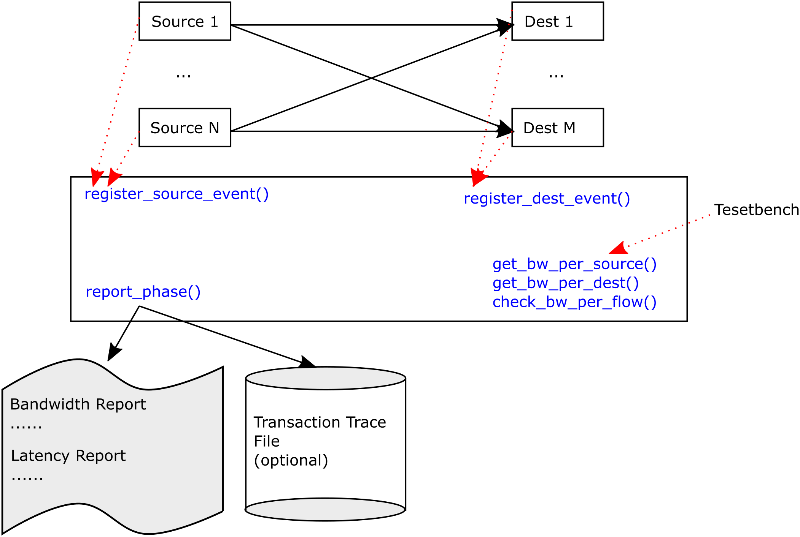

# Perf Monitor

## Introduction

The performance monitor is a UVM class that can be used to
track bandwidth and transaction rate between one or more
sources of data, and one, or more destinations. A common
usage would be to monitor the bandwidth through a 
network on chip (NoC).

The class works by providing a routine that can be called
each time a packet/transaction leaves from a source. There
is a similar function that can be called each time a
packet arrives at a destination, although registering
transactions at their destination is optional.

During the report_phase(), this monitor generates a
report of the bandwidth and transaction rate of all
sources. Assuming the transactions were registered
at their destination, the report also includes
the bandwidth and latency (min/max/avg) between 
all the flows.

The monitor also provides APIs so that the user can
query the bandwidth from a test-bench, in order to
make self-checking performance tests.




## API

Note, this class needs only be instantiated in the test-bench. It does not
require configuration and it is not connected to any System-Verilog interfaces.
Below is a list of the API provided by this class.

````
    function void register_source_event( int unsigned num_bits, 
                                         string       source_id = "Source 0",
                                         time         source_time_ns = 0,
                                         string       trans_id  = "" );
````

This function is called each time a transaction leaves a source. The user
must provide the size of the transaction in bits (used for bandwidth
calculations), the name of the source, the time of the transaction and the
transaction ID, as a string. The three last parameters are optional. If
no source is provided, a default name is used. This could be useful, in
a simple system with a single source. If no time is provided, the function
uses $time() to get the time. The transaction ID is a string which uniquely
identifies the transaction. The transaction ID string is used to associate
the transaction when it arrives at the destinations.

````
    function void register_dest_event( int unsigned num_bits  = 0,
                                       string       dest_id   = "Dest",
                                         time       dest_time_ns = 0,
                                       string       trans_id  = "" );
````

This function can be called when a transaction arrives at its destination.
If a transaction ID is provided, it is looked up in the database to see
the source where the transaction originated. If the transaction ID can not
be found, a UVM_ERROR() is reported. The user can optionally provide the
name of the destination where the transaction arrived, or this can be
omitted in a system with a single destination.


````
    function string get_bw_per_source(string curr_source);
````

This function can be called to get the bandwidth, as a string, containing
units.

````
    function string get_bw_per_dest(string curr_destination);
````
This function can be called to get the bandwidth, as a string, containing
units.


````
    function void check_bw_per_flow(string source, string dest, real expected_bw, int error_percentage);
````

This function can be called during the report phase. The user provides the
source and destination for the flow. The function checks that the bandwidth
for that flow is above the specified expected_bw (expressed in Gbps). The
user can optionally specify an error percentage, which might be used
to account for the statistical uncertaintity of the measurement.


## Plus Args

The user can request specific performance logs to be generated at the end
of test, by using plusargs.

### PERF_LOG

If the option PERF_LOG is set to YES (+PERF_LOG=YES), then at the end of test,
the monitor will write out a file with the name of the UVM_TEST appended with
perf_trace. This trace file will contain a raw record of all the transactions
that occured, which might be useful for post processing or plotting.

## Integration

There are different ways to use the perf_mon. Typically one instance
of the perf_monitor_c class is instanciated in the top-level of the
test-bench (hvl_top). A handle to this instance can then be passed to
the agents. In the agents, each time the send or monitor a transaction,
they would call the functions register_source_event() or register_dest_event().
That is all that is required. The reporting will be done automatically during
the report phase. To make self-checking performance tests, the test-case
can call the check_bw_per_flow() function to ensure that the actual
bandwidth achieved in the simulation meets the requirements specified
for the DUT.

Don't forget to import the package:
import perf_mon_pkg::*;

## Licensing
The perf_mon is released under the Apache License, Version 2.0.
