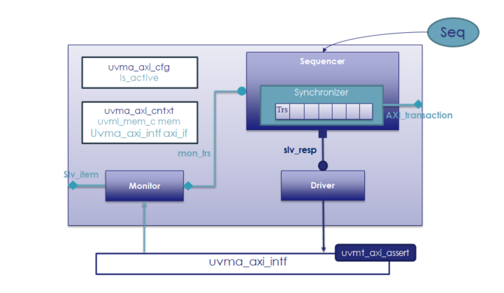

#AXI Agent documentation

<!---
Copyright 2024 Thales DIS SAS

Licensed under the Solderpad Hardware Licence, Version 2.0 (the "License");
you may not use this file except in compliance with the License.
SPDX-License-Identifier: Apache-2.0 WITH SHL-2.0
You may obtain a copy of the License at https://solderpad.org/licenses/

Original Author: Alae Eddine EZ ZEJJARI (alae-eddine.ez-zejjari@external.thalesgroup.com) – sub-contractor MU-Electronics for Thales group

-->

## Contents

[1- Introduction](#introduction)

[2- Slave Agent architecture](#slave-agent-architecture)

[3- Supported AXI4 features](#supported-axi4-features)

[4- Agent limitations](#agent-limitations)

[5- Agent configuration Fields](#_Configuration_Fields)

[6- TestBench Integration](#testbench-integration)

[7- Sequences lib](#sequences-lib)

[8- Checks](#checks)

[1. Assertion for AW channel](#assertion-for-aw-channel)

[2. Assertion for W channel](#assertion-for-w-channel)

[3. B channel assertions](#b-channel-assertions)

[4. R channel assertions](#r-channel-assertions)

[5. AR channel assertions](#ar-channel-assertions)

[6. Cross channel assertions](#cross-channel-assertions)

[9- Directory Structure](#directory-structure)

[10- Packages dependencies](#packages-dependencies)

## Introduction

This document describes the AXI4 (Advanced eXtensible Interface) SV
UVM1.1 SLAVE Agent. Aligned to AXI4 AMBA spec
<https://developer.arm.com/documentation/ihi0022/hc>

## Slave Agent architecture

*Fig-1: Slave agent architecture*

The AXI4 slave agent provides following components:

-   uvma_axi_agent_c: UVM Agent

-   uvma_axi_mon_c: Agent monitor, collects and broadcast transactions to
    the sequence in each clock.

-   uvma_axi_slv_seq_c: Generates AXI response to master depending on
    the received transaction from monitor

-   uvma_axi_sqr_c: Sequencer and Synchronizer, receives responses from
    reactive sequence and synchronize responses to driver.

-   uvma_drv_c: drive the vif with the responses received from
    sequencer.

-   uvma_axi_cntxt_c: Agent context, instantiate VIF uma_axi_intf and
    memory uvml_mem. VIF and Memory are accessible in all components
    through context.

-   uva_axi_cfg_c: Agent configuration, all available configuration
    fields are described in Configuration Fields.

-   uvmt_axi_assert_c: Assertion module banded to the AXI interface.

-   axi_transaction: encapsulates the life cycle of a transaction. It
    can be used by any component outside the agent that needs
    information about the AXI transaction.

## Supported AXI4 features

Only SLAVE mode is supported, features are:

-   Out of order transactions : Transactions with different IDs
    can complete in any order

-   Outstanding transactions : Multiple writes or reads
    transactions run at the same time.

-   Channel delay : Randomize the ready to valid latency, for AW, W and
    AR channels.

-   Randomize error injection : inject error by randomizing response
    signal, or by injection error from the sequences.

-   Atomics transactions : the agent support this feature from AXI5.

-   Multiple region signaling : A region identifier, sent on
    the address channel for each transaction. If the master doesn't
    support this feature, the user must configure the memory mapping in
    the test class.

-   Access permissions : access permissions signals can be used
    to protect against illegal transactions. If the master doesn't
    support this feature, the user must configure the memory attribution
    in the test class and the agent will check the access permission
    using the address.

## Agent limitations

The slave axi4 agent does not support:

-   QoS signaling

-   User-defined signaling

The AXI protocol does not define the functions of these signals.

## Agent configuration Fields

-   **is_active**: switch the agent mode to active. The agent support
    two mode UVM_ACTIVE and UVM_PASSIVE.

-   **trn_log_enabled**: Enabling AXI transaction logger when 1.

-   **axi_lock_enabled:** Enabling Exclusive access when 1.

-   **randomization_enabled:** Enabling randomization of response
    signals when 1.

-   **ordering_read_mode**: Ordering mode of read transactions response.
    there are three modes outstanfing, out of order and the regular
    mode.

-   **ordering_write_mode**: Ordering mode of write transactions
    response. (Same mode of read transaction)

-   **max_outstanding_write_trs**: Maximum allowed outstanding write
    transactions depth.

-   **max_outstanding_read_trs**: Maximum outstanding read transactions
    depth.

-   **write_response_latency**: Maximum delay between two read
    outstanding transaction.

-   **read_response_latency**: Maximum delay between two write
    outstanding transaction.

-   **axi_region_enabled:** Enabling multiple region signaling when 1.

-   **axi_prot_enabled:** Enabling access permissions when 1.

-   **cov_model_enabled:** Enabling functional coverage when 1.

-   **m_addr_start/** **m_addr_end:** The first/last memory address.

-   **m_num_part:** Number of memory partition, if the master doesn't
    support AXREGION

-   **m_num_axi_region:** Number of memory region.

-   **m_part_td:** configuration of each memory partition or memory
    region.

## TestBench Integration

In the sv testbench instantiate the VIF and connect it to the DUT master
interface:

   `uvma_axi_intf                axi_if(
                                         .clk(clknrst_if.clk),
                                         .rst_n(clknrst_if.reset_n)
                                      );`

//DUT connection Active mode

   `assign dut.aw_ready = axi_if.aw_ready;`

   `assign dut.ar_ready = axi_if.ar_ready;`

...

   `assign axi_if.aw_valid = dut.aw_valid;`

   `assign axi_if.w_valid  = dut.w_valid;`

Then set the VIF to agent instantiation in env:

     `uvm_config_db#(virtual uvma_axi_intf)::set(.cntxt(null),.inst_name("*"), .field_name("axi_vif"), .value(axi_if));`

In env instantiate and create the AXI agent:

   `uvma_axi_agent_c       axi_agent;
`
   `axi_agent     = uvma_axi_agent_c::type_id::create("axi_agent",this);`

Instantiate, create and set the config to the agent:

   `uvma_axi_cfg_c        axi_cfg;`
   
   `axi_cfg      = uvma_axi_cfg_c::type_id::create("axi_cfg");`

   `uvm_config_db#(uvma_axi_cfg_c)::set(this, "*axi_agent", "cfg",cfg.axi_cfg);`

## Sequences lib

This agent provides 2 sequences:

1.  Preload sequence: this sequence initializes the memory with the
    compiled test.

2.  Slave reactive sequence: generates the appropriate response after he
    take the request decoded by the synchronizer. when the response is
    generated the sequence send it via the driver

## Checks

In order to check the AXI protocol specification, each channel has its
own assertion set.

### Assertion for AW channel:

 | Assertion                  | Description                                                 |
 | -------------------------- | ------------------------------------------                  |
 | AXI4\_\*\_STABLE           | Signal must remain stable when AWVALID is asserted and      |
 |                            | AWREADY is LOW                                              |
 |                            |                                                             |
 | AXI4\_\*\_X                | Unknown signal value is not permitted when AWVALID is HIGH  |
 |                            |                                                             |
 | AXI4_AWVALID_X             | A value of X on AWVALID is not permitted when not in reset  |
 |                            |                                                             |
 | AXI4_AWREADY_X             | A value of X on AWREADY is not permitted when not in reset  |
 |                            |                                                             |
 | AXI4_ERRM_AWADDR_BOUNDARY  | A write burst cannot cross a 4KB boundary                   |
 |                            |                                                             |
 | AXI_AWLEN_WRAPP_BURST      | wrapping bursts cannot have a length different to           |
 |                            |  2, 4, 8, or 16,                                            |
 |                            |                                                             |
 | AXI4_AW_BURST_CANT_2b11    | A value of 2'b11 on AWBURST is not permitted when AWVALID   |
 |                            | is HIGH                                                     |
 |                            |                                                             |
 | AXI4_AW_VALID_READY        | aw_valid must remain asserted until aw_ready is HIGH        |
 |                            |                                                             |
 | AXI_AWADDR_WRAP_ALIGN      | A write transaction with burst type WRAP has an aligned     |
 |                            | address                                                     |
 |                            |                                                             |
 | AXI_ERRM_AWSIZE            | The size of a write transfer does not exceed the width of   |
 |                            | the data interface                                          |
 |                            |                                                             |
 | AXI4_AWVALID_RESET         | AWVALID is LOW for the first cycle after ARESETn goes HIGH  |
 |                            |                                                             |
 | AXI4_AWLEN_LOCK            | Exclusive access transactions cannot have a length greater  |
 |                            | than 16 beats                                               |
 |                            |                                                             |
 | AXI4_AWCACHE_LOW           | When AWVALID is HIGH and AWCACHE\[1\] is LOW                |
 |                            | then AWCACHE\[3:2\] are also LOW                            |
 |                            |                                                             |
 | AXI4_AWLEN_FIXED           | Transactions of burst type FIXED cannot have a length       |
 |                            | greater than 16 beats                                       |

\* applies for signals: awid, awaddr, awlen, awsize, awburst, awlock,
awcache, awprot, awuser, awqos and awregion.

### Assertion for W channel:

  |Assertion          | Description                                                     |
  |-------------------| --------------------------------------------------------------- |
  |AXI4\_\*\_STABLE   | Signal remains stable when WVALID is asserted and WREADY is LOW.|
  |                   |                                                                 |
  |AXI4\_\*\_X        | Unknown signal value is not permitted when WVALID is HIGH.      |
  |                   |                                                                 |
  |AXI4_WVALID_X      | A value of X on WVALID is not permitted when not in reset.      |
  |                   |                                                                 |
  |AXI4_WREADY_X      | A value of X on WREADY is not permitted when not in reset.      |
  |                   |                                                                 |
  |AXI4_WVALID_RESET  | WVALID is LOW for the first cycle after ARESETn goes HIGH       |

**\*** applies for signals: wdata, wuser, wlast and wstrb.

## B channel assertions:

  | Assertion           | Description                                                       |
  | ------------------- | ----------------------------------------------------------------- |
  | AXI4\_\*\_STABLE    | Signal remains stable when BVALID is asserted, and BREADY is LOW. |
  |                     |                                                                   |
  | AXI4\_\*\_X         | Unknown signal value is not permitted when BVALID is HIGH.        |
  |                     |                                                                   |
  | AXI4_BVALID_X       | A value of X on BVALID is not permitted when not in reset.        |
  |                     |                                                                   |
  | AXI4_BREADY_X       | A value of X on BREADY is not permitted when not in reset.        |
  |                     |                                                                   |
  | AXI4_BVALID_RESET   | BVALID is LOW for the first cycle after ARESETn goes HIGH         |

**\*** applies for signals: bid, buser and bresp.

## R channel assertions:

  | Assertion           | Description                                                       |
  | ------------------- | ----------------------------------------------------------------- |
  | AXI4\_\*\_STABLE    | Signal remains stable when RVALID is asserted, and RREADY is LOW. |
  |                     |                                                                   |
  | AXI4\_\*\_X         | Unknown signal value is not permitted when RVALID is HIGH.        |
  |                     |                                                                   |
  | AXI4_RVALID_X       | A value of X on RVALID is not permitted when not in reset.        |
  |                     |                                                                   |
  | AXI4_RREADY_X       | A value of X on RREADY is not permitted when not in reset.        |
  |                     |                                                                   |
  | AXI4_RVALID_RESET   | RVALID is LOW for the first cycle after ARESETn goes HIGH         |

**\*** applies for signals: rid, ruser, rdata , rlast and rresp.

## AR channel assertions:

  | Assertion                   | Description                                                                     |
  | --------------------------- | ------------------------------------------------------------------------------- |
  | AXI4\_\*\_STABLE            | Signal must remain stable when ARVALID is asserted and ARREADY is LOW           |
  |                             |                                                                                 |
  | AXI4\_\*\_X                 | Unknown signal value is not permitted when ARVALID is HIGH                      |
  |                             |                                                                                 |
  | AXI4_ARVALID_X              | A value of X on ARVALID is not permitted when not in reset                      |
  |                             |                                                                                 |
  | AXI4_ARREADY_X              | A value of X on ARREADY is not permitted when not in reset                      |
  |                             |                                                                                 |
  | AXI4_ERRM_ARADDR_BOUNDARY   | A read burst cannot cross a 4KB boundary                                        |
  |                             |                                                                                 |
  | AXI_AR_LEN_WRAPP_BURST      | A read transaction with burst type WRAP has a length of 2, 4, 8, or 16          |
  |                             |                                                                                 |
  | AXI4_AR_BURST_CANT_2b11     | A value of 2'b11 on ARBURST is not permitted when ARVALID is HIGH               |
  |                             |                                                                                 |
  | AXI4_AR_VALID_READY         | AR_valid must remain asserted until AR_ready is HIGH                            |
  |                             |                                                                                 |
  | AXI_ARADDR_WRAP_ALIGN       | A read transaction with burst type WRAP has an aligned address                  |
  |                             |                                                                                 |
  | AXI_ERRM_ARSIZE             | The size of a read transfer does not exceed the width of the data interface     |
  |                             |                                                                                 |
  | AXI4_ARVALID_RESET          | ARVALID is LOW for the first cycle after ARESETn goes HIGH                      |
  |                             |                                                                                 |
  | AXI4_ARLEN_LOCK             | Exclusive access transactions cannot have a length greater than 16 beats        |
  |                             |                                                                                 |
  | AXI4_ARCACHE_LOW            | When ARVALID is HIGH and ARCACHE\[1\] is LOW, then ARCACHE\[3:2\] are also LOW  |
  |                             |                                                                                 |
  | AXI4_ARLEN_FIXED            | Transactions of burst type FIXED cannot have a length greater than 16 beats     |

**\*** applies for signals: arid, araddr, arlen, arsize, arburst,
arlock, arcache, arprot, aruser, arqos and arregion.

## Cross channel assertions:

In addition to the channels assertion modules, there is a sixth module
where we have implemented assertions that are common to several
channels.

  | Assertion             | Description                                                                         |
  | --------------------- | ----------------------------------------------------------------------------------- |
  | AXI4_RESET            | During reset, Manager interface drive aw_valid, ar_valid and w_valid LOW            |
  |                       |                                                                                     |
  | w_data_num            | Write data arrives and WLAST is set, and the WDATA count is equal to AWLEN.         |
  |                       |                                                                                     |
  | w_data_num_not        | Write data arrives and WLAST is not set, and the WDATA count is not equal to AWLEN. |
  |                       |                                                                                     |
  | axi4_bresp_timing     | The Subordinate must wait for AWVALID, AWREADY, WVALID, WREADY and also WLAST       |
  |                       | to be asserted before asserting BVALID                                              |
  |                       |                                                                                     |
  | axi4_bresp_exokay     | EXOKAY write response it\'s given only to an exclusive write access                 |
  |                       |                                                                                     |
  | axi4_bresp_all_done   | All write transaction are matched with a corresponding buffered response            |
  |                       |                                                                                     |
  | axi4_errm_wstrb       | Check if Write strobes is asserted for the correct byte lanes only                  |
  |                       |                                                                                     |
  | axi4_errs_rid         | Check if the slave send a read data that follow address that it relates to          |
  |                       |                                                                                     |
  | r_last_assert         | The subordinate assert the RLAST signal when it is driving the final read transfer  |
  |                       | in the burst.                                                                       |
  |                       |                                                                                     |
  | r_burst_ter_early     | Check if the read burst not terminate early                                         |
  |                       |                                                                                     |
  | axi4_rresp_exokay     | EXOKAY read response it\'s given only to an exclusive read access                   |
  |                       |                                                                                     |
  | axi4_errs_rdata_num   | All outstanding read bursts have to be completed                                    |

## Atomic assertions:

In addition to the AXI4 assertion modules, there is a seventh module for Atomic transactions.

  | Assertion                  | Description                                                                         |
  | ---------------------      | ----------------------------------------------------------------------------------- |
  | AXI4_ATOP_X                | Unknown signal value is not permitted when ARVALID is HIGH                          |
  |                            |                                                                                     |
  | AXI_ATOP_LEN_SIZE          | Check if an atomic transaction has a burst length greater than one, the AWSIZE must |
  |                            | be full data bus width                                                              |
  |                            |                                                                                     |
  | AXI_ATOP_ALIGN             | AWADDR must be aligned to the data size for AtomicStore, AtomicLoad, and AtomicSwap |
  |                            |                                                                                     |
  | AXI_ATOP_BURST_INCR        | The burst type must be INCR for AtomicStore, AtomicLoad, and AtomicSwap operations  |
  |                            |                                                                                     |
  | AXI_ATOP_DATA              | The write data must be equal to 1, 2, 4 or 8 bytes for AtomicStore, AtomicLoad,     |
  |                            | and AtomicSwap operations.                                                          |
  |                            |                                                                                     |
  | AXI_ATOP_COMP_DATA         | The write data must be equal to 2, 4, 8, 16, or 32 bytes for AtomicCompare operation|
  |                            |                                                                                     |
  | AXI_ATOP_COMP_ALIGN        | The address must be aligned to a single write data value for AtomicCompare          |
  |                            |                                                                                     |
  | AXI_ATOP_COMP_BURST        | The burst type of an AtomicCompare transaction must be INCR if AWADDR points to the |
  |                            | lower half of the transaction, or WRAP if AWADDR points to the upper half of        |
  |                            | the transaction.                                                                    |
  |                            |                                                                                     |
  | AXI_ATOP_ACCESS            | AWLOCK must be 0 for Atomic operation                                               |
  |                            |                                                                                     |
  | x_amo_id                   | The ID used to identify an Atomic transactions must not be used for other           |
  |                            | transactions that are outstanding at the same time.                                 |
  |                            |                                                                                     |
  | axi4_errs_amo_rid          | The slave must send a read data that follow the address that it relates to          |
  |                            |                                                                                     |
  | amo_r_comp_len             | The length of the read transaction must be the half of the write transaction        |
  |                            | for AtomicCompare.                                                                  |
  |                            |                                                                                     |
  | amo_comp_len               | The length of the read transaction must be equal to the lenght of write transaction |
  |                            | for Atomic operation except AtomicCompare                                            |

## Directory Structure

-   docs: Documents describing the AXI.

-   examples: Samples for users

-   src: Source code for this package

## Packages dependencies

This agent is dependent on the following UVM packages:

-   uvm_pkg

-   uvml_trn_pkg

-   uvml_logs_pkg

-   uvml_mem_pkg
